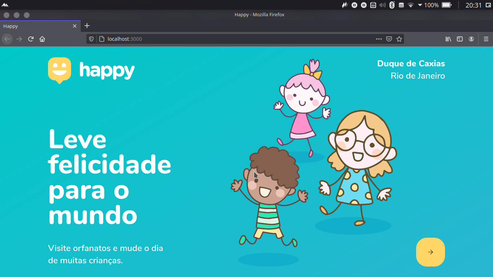

<h1 align="center">
    
</h1>

<h4 align="center"> 
	Leve felicidade para o mundo!
</h4>

<p align="center">	
  
	
  <a href="https://www.linkedin.com/in/jonathanpauluze/">
    
  </a>
  
  <a href="https://github.com/jonathanpauluze/happy/commits/main">
    
  </a>

  

</p>
<p align="center">
  <a href="#information_source-o-que-e-a-next-level-week">Next Level Week</a>&nbsp;&nbsp;&nbsp;|&nbsp;&nbsp;&nbsp;
  <a href="#computer-projeto">Projeto</a>&nbsp;&nbsp;&nbsp;|&nbsp;&nbsp;&nbsp;
  <a href="#rocket-tecnologias">Tecnologias</a>&nbsp;&nbsp;&nbsp;|&nbsp;&nbsp;&nbsp;
  <a href="#black_nib-design">Design</a>&nbsp;&nbsp;&nbsp;|&nbsp;&nbsp;&nbsp;
  <a href="#wrench-como-rodar-o-projeto">Como rodar o projeto</a>&nbsp;&nbsp;&nbsp;|&nbsp;&nbsp;&nbsp;
  <a href="#memo-licenca">Licença</a>
</p>

## :information_source: O que é a Next Level Week?

O NLW é um evento com muito código, desafios, networking e um único objetivo: te levar para o próximo nível.

Programação é uma disciplina prática. Ou seja, para dominar uma tecnologia não basta apenas conhecer a teoria ou ler a documentação: você precisa colocar a mão no código.

Através do método ensinado você vai aprender novas ferramentas, conhecer novas tecnologias e descobrir hacks que vão impulsionar a sua carreira.

Saiba mais sobre a NLW [clicando aqui](https://nextlevelweek.com).


## :computer: Projeto

O Happy teve como ideia base o dia das crianças (12/10). O objetivo é conectar pessoas a orfanatos para fazer visitas e tornar o dia das crianças mais especial.

<h1 align="center">
    
</h1>


## :rocket: Tecnologias

Lista de tecnologias utilizadas no projeto:

- [TypeScript](https://www.typescriptlang.org/)
- [Node.js](https://nodejs.org/)
- [React](https://reactjs.org)
- [React Native](https://facebook.github.io/react-native/)

## :black_nib: Design

Confira o design da aplicação no [Figma](https://www.figma.com/file/mDEbnoojksG4w8sOxmudh3/Happy-Web/duplicate).

## :wrench: Como rodar o projeto

Você precisa ter instalado:
- [Git](https://git-scm.com)
- [Node.js](https://nodejs.org/)
- [Yarn](https://yarnpkg.com/)

### Faça um clone do projeto

```bash
$ git clone https://github.com/jonathanpauluze/happy
```

### Instale as dependências do backend e inicie o servidor
```bash
# Acesse a pasta do backend
$ cd happy/backend

# Instale as dependências
$ yarn install

# Rode as migrations
$ yarn typeorm migration:run

# Inicie o servidor (iniciará na porta 3333)
$ yarn dev
```

### Instale as dependências do frontend e rode o projeto

```bash
# Acesse a pasta do frontend
$ cd happy/frontend

# Instale as dependências
$ yarn install

# Rode o projeto (iniciará na porta 3000)
$ yarn start
```

## :memo: License

Este projeto está sob a [licença do MIT](https://github.com/jonathanpauluze/happy/blob/main/LICENSE).

Feito com ♥ por Jonathan Pauluze